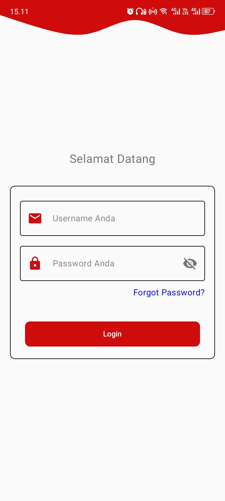
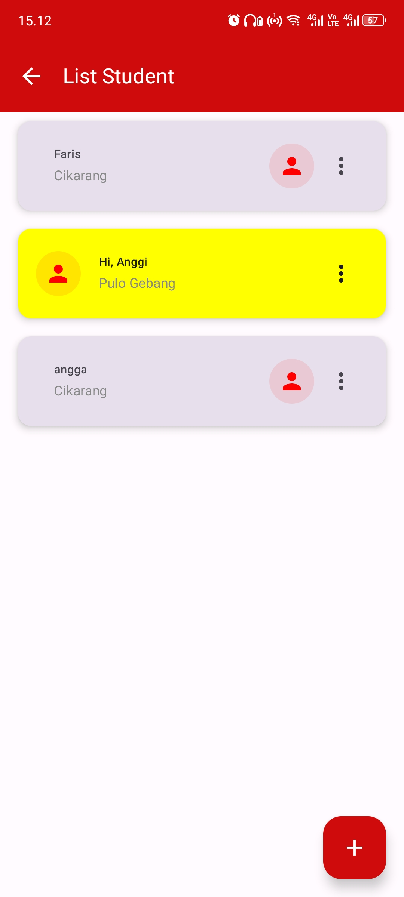

# Alfagift Intern Assessment

## Project Overview
This project is an Android application developed as part of a technical test for the position of Android Developer Intern at Alfagift. The app is built using **Kotlin** and follows the **MVVM architecture pattern** with **Clean Architecture** principles. Dependency injection is implemented using **Koin**.

The application consists of two main features:

1. **Login Feature**
    - Allows the user to log in using a username and password.
    - Validation ensures both fields are not empty.
    - Only the username `alfagift-admin` and password `asdf` are accepted for successful login.

2. **List of Students Feature**
    - Displays a list of 10 students with their names, profile pictures, and addresses.
    - Data is fetched from Firebase Firestore.
    - Utilizes RecyclerView for displaying the list.

## Features
- **Login Page**
    - Username and password input fields.
    - Login button with validation.
    - Error messages for invalid or empty input.

- **Student List Page**
    - Displays a list of students in a RecyclerView.
    - Each student item includes a name, profile picture, and address.
    - Real-time data sync from Firebase Firestore.

## Technologies Used
- **Kotlin** for native Android development.
- **Jetpack Components** (ViewModel, LiveData, etc.).
- **Koin** for dependency injection.
- **Firebase Firestore** for data storage and retrieval.
- **RecyclerView** for the student list.
- **Clean Architecture** for code organization and maintainability.
- **JUnit 5** for unit testing.

## Skills Demonstrated
This project highlights my ability to:
- Structure code using **MVVM** and **Clean Architecture** for better maintainability and scalability.
- Implement **dependency injection** using **Koin** for efficient dependency management.
- Utilize **RecyclerView** for building dynamic and efficient UI components.
- Write and execute unit tests using **JUnit 5** to ensure code quality and reliability.
- Ensure robust input validation and smooth user experience.

## Folder Structure
```
Alfagift-Intern-Assessment
├── app
|   ├── google-services.json        # Firebase configuration file
│   ├── build.gradle
│   ├── src
│   │   ├── main
│   │   │   ├── java
│   │   │   │   ├── gli.intern.technicaltestintern_2
│   │   │   │   │   ├── di          # Dependency injection setup
│   │   │   │   │   ├── domain      # Domain layer (Use cases, Models)
│   │   │   │   │   ├── data        # Data layer (Repositories, Data Sources)
│   │   │   │   │   ├── ui          # Presentation layer (Activities, Fragments, ViewModels)
│   │   │   │   │   ├── utils       # Utility classes
│   │   │   │   │   └── App.kt      # Application class
│   │   │   ├── res
│   │   │   │   ├── layout          # XML layouts
│   │   │   │   ├── drawable        # Drawables (images, shapes)
│   │   │   │   └── values          # Values (strings, colors, dimensions)
├── gradle
├── build.gradle
└── README.md
```

## Firebase Setup

### Prerequisites
- Create a Firebase project at [Firebase Console](https://console.firebase.google.com/)
- Add an Android app to your Firebase project

### Firebase Configuration Steps
1. **Download google-services.json**
    - In Firebase Console, go to Project Settings
    - Select your Android app
    - Click "Download google-services.json"

2. **Project-level build.gradle**
   Add the following to your project's `build.gradle`:
   ```groovy
   buildscript {
       dependencies {
           classpath 'com.google.gms:google-services:4.4.0'
       }
   }
   ```

3. **App-level build.gradle**
   Apply the following plugins and dependencies:
   ```groovy
   plugins {
       id 'com.android.application'
       id 'com.google.gms.google-services'
   }

   dependencies {
       // Firebase Firestore
       implementation 'com.google.firebase:firebase-firestore-ktx:24.10.0'
       
       // Other existing dependencies...
   }
   ```

4. **Place google-services.json**
    - Copy the downloaded `google-services.json`
    - Place it in the `app/` directory of your project

5. **Sync Project**
    - Sync your project with Gradle files
    - Rebuild the project

## Firestore Data Structure
Ensure your Firestore collection follows this structure:
```
students (collection)
└── studentDocument
    ├── name: String
    ├── address: String
    └── profilePictureUrl: String
```

## Getting Started

1. **Clone the Repository**
   ```bash
   git clone https://github.com/your-username/AlfagiftStudentApp.git
   cd AlfagiftStudentApp
   ```

2. **Firebase Setup**
    - Follow the Firebase Configuration Steps above
    - Ensure `google-services.json` is added

3. **Setup and Run the Project**
    - Open the project in Android Studio.
    - Sync Gradle dependencies.
    - Run the app on an emulator or physical device.

4. **Dependencies**
    - Ensure you have the latest Android Studio and Kotlin version installed.

## Screenshots
| Feature               | Screenshot                                                             |
|-----------------------|------------------------------------------------------------------------|
| **Login Screen**      |    |
| **Student List Page** |  |


## Unit Testing
- Unit tests have been written using **JUnit 5** to ensure functionality and reliability of the application.
- Tests cover:
    - Login validation logic.
    - Data fetching and processing for the student list.

To run the tests:
```bash
./gradlew test
```

## Note
This project was created as part of a technical test for the Android Developer Intern position at Alfagift. It demonstrates my passion for learning and growing as an Android developer by implementing industry-standard practices.